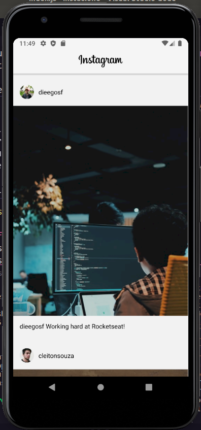

<h1 align="center">
    
</h1>

<h2 align="center">
   
 UI-Clone-Instagram-Feed 

</h2>

  
  

  <a href="#rocket-tecnologias">Tecnologias</a>&nbsp;&nbsp;&nbsp;|&nbsp;&nbsp;&nbsp;
  <a href="#computer-projeto">Projeto</a>&nbsp;&nbsp;&nbsp;|&nbsp;&nbsp;&nbsp;

 
<h3>Imagens da aplicação:<h3>

  

## :rocket: Tecnologias
- ReactJS
